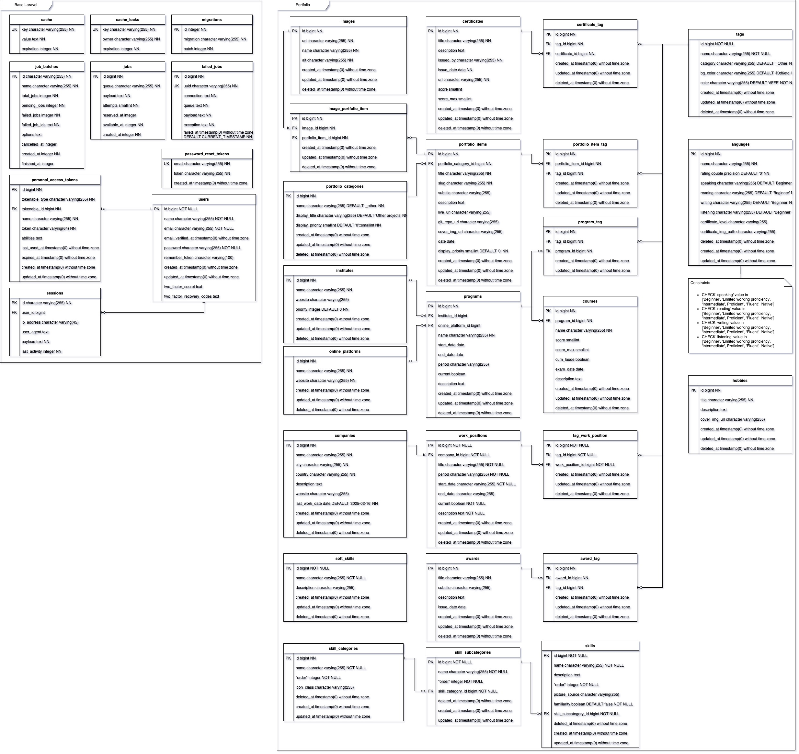

[&#8592; Back to the previous docs](../README.md)
<!-- TOC -->
* [Database](#database)
  * [ER Diagram](#er-diagram)
<!-- TOC -->

# Database

The current database in use is PostgreSQL.

## ER Diagram

